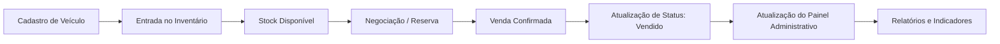
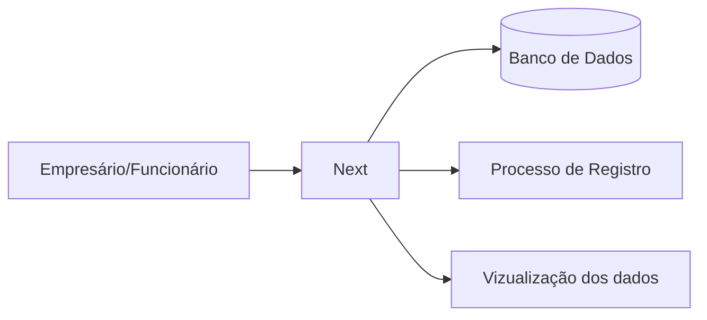
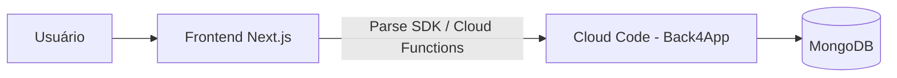
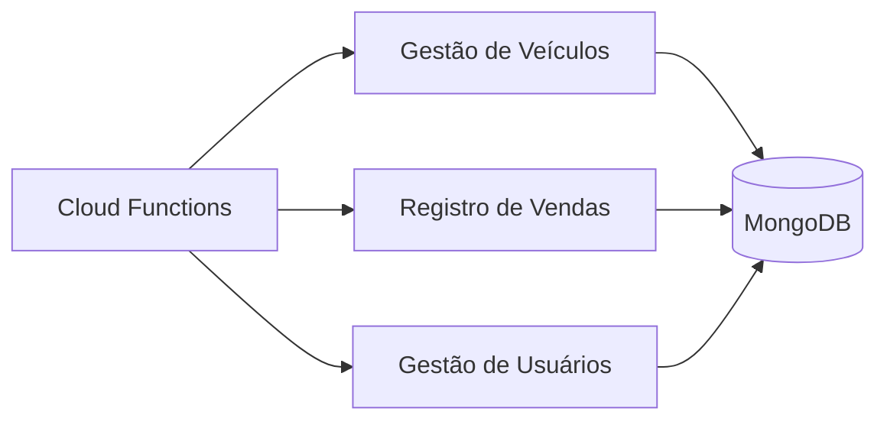

<h1 align="center"> Next</h1>

Projeto desenvolvido durante a disciplina de Programação Web e Mobile.

  <a href="#-documentação">Documentação</a>&nbsp;&nbsp;&nbsp;|&nbsp;&nbsp;&nbsp;
  <a href="#-projeto">Projeto</a>&nbsp;&nbsp;&nbsp;|&nbsp;&nbsp;&nbsp;
  <a href="#-tecnologias">Tecnologias</a>&nbsp;&nbsp;&nbsp;|&nbsp;&nbsp;&nbsp;
  <a href="%EF%B8%8F-funcionalidades">Funcionalidades</a>&nbsp;&nbsp;&nbsp;|&nbsp;&nbsp;&nbsp;
  <a href="#-fluxo-do-sistema">Fluxo do Sistema</a>&nbsp;&nbsp;&nbsp;|&nbsp;&nbsp;&nbsp;
  <a href="%EF%B8%8F-arquitetura-c4-model">Arquitetura (C4 Model)</a>&nbsp;&nbsp;&nbsp;|&nbsp;&nbsp;&nbsp;
  <a href="#-como-rodar-o-projeto">Como Rodar o Projeto</a>&nbsp;&nbsp;&nbsp;|&nbsp;&nbsp;&nbsp;
  <a href="#-estrutura-da-documentação">Estrutura da Documentação</a>&nbsp;&nbsp;&nbsp;|&nbsp;&nbsp;&nbsp;
  <a href="#-integrantes">Integrantes</a>&nbsp;&nbsp;&nbsp;|&nbsp;&nbsp;&nbsp;
  <a href="#-licença">Licença</a>

  

 

  

## 🌐 Documentação
- 📄 **Documentação em PDF**: [Clique aqui para acessar](documentacao/next_frontend.pdf)

## 💻 Projeto

A Next é um sistema desenvolvido para gerenciamento e venda de carros seminovos, criado com o objetivo de aplicar conceitos avançados de Análise e Projeto de Software em um cenário real. Esta versão do projeto evoluiu a arquitetura original para um frontend em Next.js consumindo um backend serverless (Cloud Code) hospedado no Back4App, mantendo as boas práticas de desenvolvimento, organização e escalabilidade da aplicação.

## 🚀 Tecnologias

Esse projeto foi desenvolvido com as seguintes tecnologias:

- Next.js (App Router)
- React
- JavaScript
- Back4App (Parse Server / Cloud Code)
- MongoDB (gerenciado pelo Back4App)
- VS Code
- API Console (Back4App)
- Git e Github

## 🛠️ Funcionalidades

- Gestão de Inventário: Registo completo de veículos, incluindo marca, modelo, ano, preço e tipo.
- Módulo de Vendas: Fluxo estruturado para o registo de transações e histórico de negociações.
- Painel Administrativo: Visualização rápida de métricas de entrada e saída, facilitando o controlo do stock.
- Gestão de Usuários: Cadastro, login e controle de acesso da equipe comercial.
- Interface Otimizada: Foco na experiência do utilizador para agilizar o processo de gestão e venda.

## 🧭 Fluxo do Sistema

## 🏗️ Arquitetura (C4 Model)

## Contexto do Sistema

## Containers

## Componentes

## 👨‍💻 Integrantes

<table>
  <tr>
    <td align="center">
       
      <a href="https://www.linkedin.com/in/emerson-willian-19984630b/" target="_blank">
        <b>Emerson Dias</b> <b>RA:00000854559 </b>
      </a>
    </td>
    <td align="center">
       
      <a href="https://www.linkedin.com/in/maria-clara-de-oliveira-barbosa-07457b364/" target="_blank">
        <b>Maria Clara</b> <b>RA:00000855589 </b>
      </a>
    </td>
    <td align="center">
       
      <a href= "https://www.linkedin.com/in/marcela-cristine-cantalice-santos-994309410/" target="_blank">
        <b>Marcela Cantalice</b> <b>RA:00000853203 </b>
      </a>
    </td>
    <td align="center">
       
      <a href="https://www.linkedin.com/in/marcos-dalyson-9457373b3?utm_source=share_via&utm_content=profile&utm_medium=member_android" target="_blank">
        <b>Marcos Dalyson</b> <b>RA:00000854567 </b>
      </a>
    </td>
    <td align="center">
       
      <a href="https://www.linkedin.com/in/mateus-oliveira-172492213" target="_blank">
        <b>Mateus Oliveira</b> <b>RA:00000855658 </b>
      </a>
    </td>
    </td>
  </tr>
</table>

## 📝 Licença

Esse projeto está sob a licença MIT.
